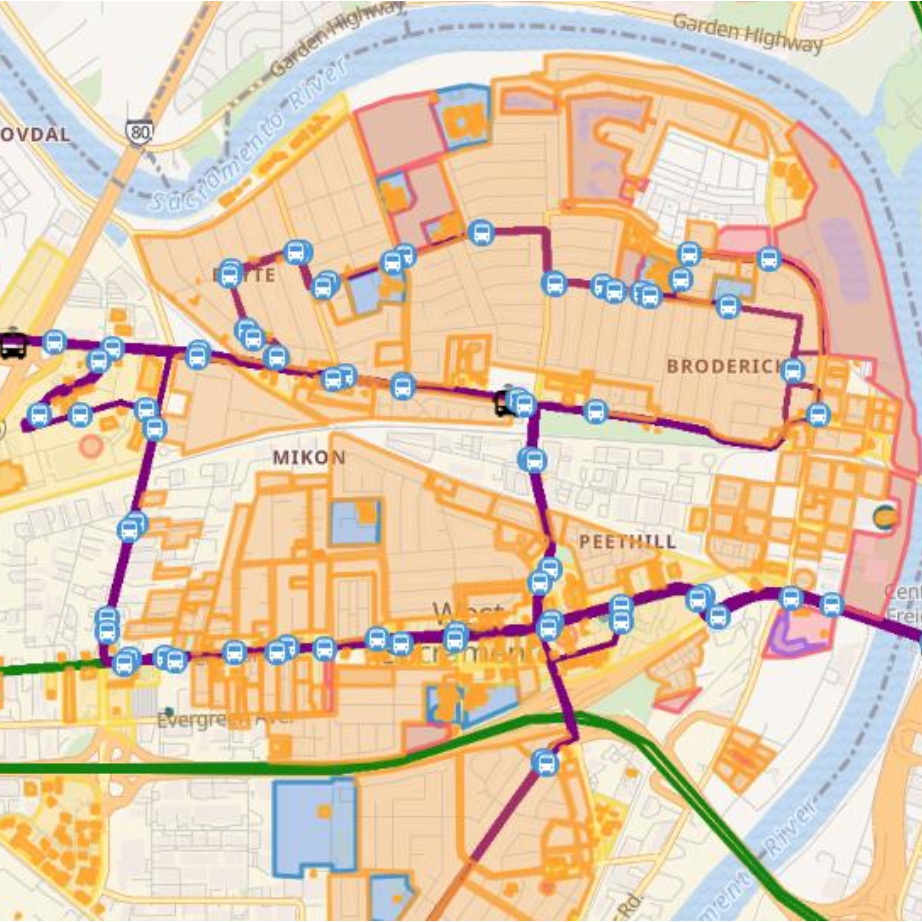
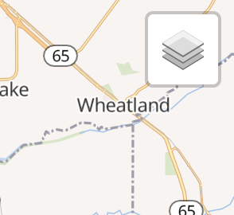
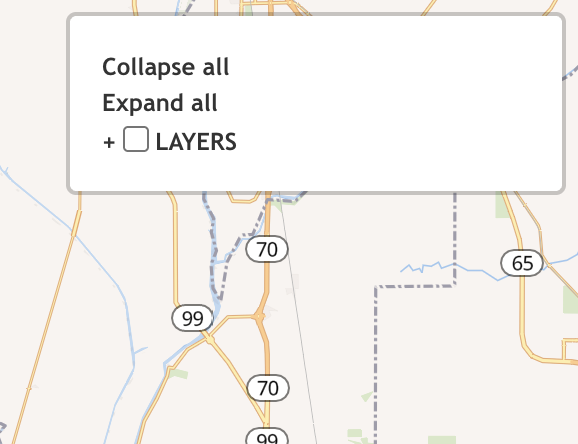
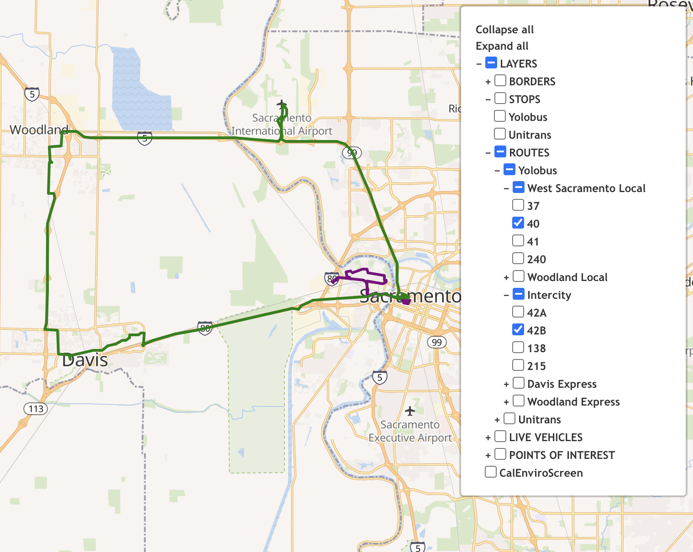
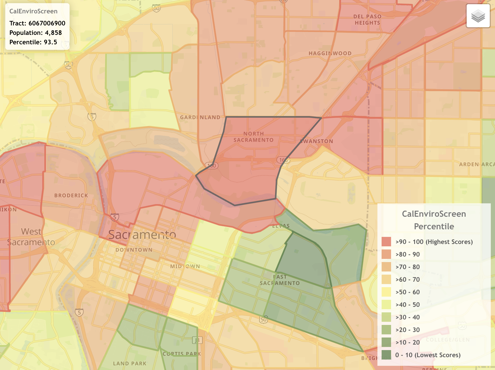
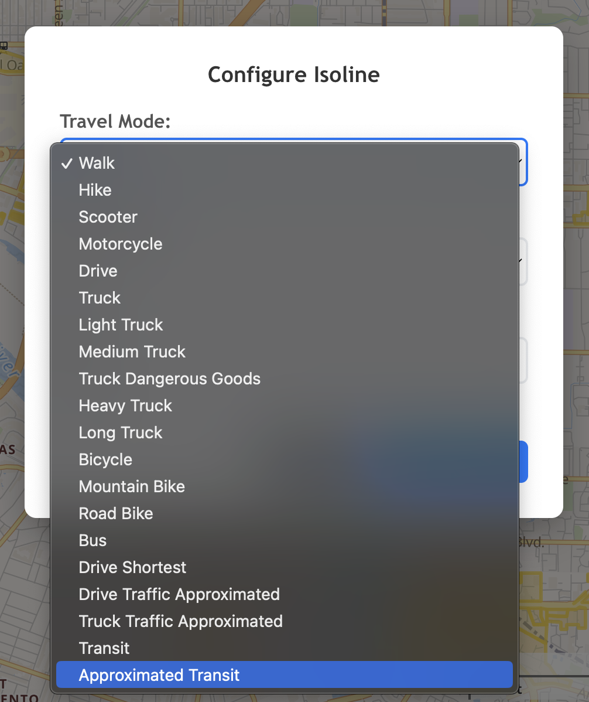
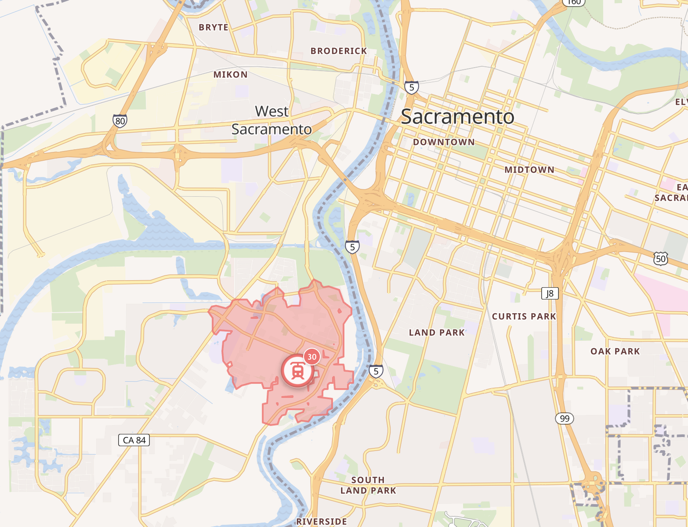
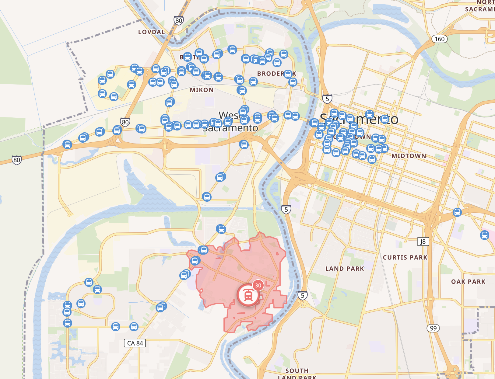

# Interactive Planning Webmap

  

## 🌟 Highlights

- Visualizes static transit, point-of-interest (POI), and boundary data as toggleable feature layers on a Leaflet map
- Overlays the base map with a CalEnviroScreen database layer for cross-referencing with infrastructure data
- Enables independent and simultaneous real-time tracking of all active vehicles
- Integrates the Geoapify Isoline API, which calculates catchment areas and generates dynamic isolines based on a map click event and user input parameters

## 🗺️ Overview

### Project Goals and Objectives

The Interactive Planning Webmap is a custom GIS web application which consolidates multicounty transit data, POIs, and cumulative impact (CI) scores into one map to identify coverage gaps in fixed-route service and consider key destinations when designing routes. The Leaflet map integrates dynamic isoline generation to measure POI and stop reachability, and a CalEnviroScreen database to cross-reference infrastructure data with regional pollution burdens and socioeconomic vulnerability indicators. The project is designed to enhance the Yolo County Transportation District’s (YoloTD) transportation planning process, assisting with the design of Yolobus service and coordination with other transit networks to improve coverage and connectivity for riders.

### Background and Problem Statement

Currently, YoloTD does not have a central resource which standardizes and consolidates up-to-date, regional transit, POI, and socioeconomic data. This poses a barrier for transportation planners to identify and consider existing service gaps, destination reachability, and probable travel patterns when periodically adapting fixed-route services for current transportation needs.

### Target Audience

The Interactive Planning Webmap is built for transit planning and operations staff involved in evaluating and redesigning fixed-route service. Planners may use the map to identify potential stop locations, stop sequences, areas for service expansion, and target outreach areas. Planners may also use the map in conjunction with Automatic Passenger Counter (APC) data to analyze high- and low-performing routes.

### ✍️ Author

I'm [Jackie Welte](https://github.com/jackiewelte) and I developed the Interactive Planning Webmap to directly improve the YoloTD transit planning process and design a GIS web tool with an agency- and region-specific data model that any transportation agency can adapt.

## 🚌 Usage instructions

[Interactive Planning Webmap](https://interactive-planning-webmap-9pms.onrender.com/)

### Toggle the Layers Control

Hover over the **Layers Control** icon to view the list of feature layers.

  

Click on the text next to the plus sign (e.g. **LAYERS**) to display a sublist of layer groups.

  

Select the checkbox next to the layer or layer group you would like to view on the map.

  

> *Click **Expand All** to display the list of every available layer, and click **Collapse All** to collapse the list.*

> *Selecting a single layer (no plus sign) will make only that layer visible, while selecting a layer group (plus sign) will display all layers in the group.*

### View CI Score Data

When the CalEnviroScreen layer is active, hover over a census tract on the map to view its **Tract** number, **Population**, and CI score **Percentile**.

  

### Generate an Isoline Polygon

Click the map at the point you would like the isoline to originate from. In the **Configure Isoline** box, select the desired value from the dropdown menu for **Travel Mode**, **Isoline Type**, and **Value**.

  

Click **Create Isoline** to generate the isoline, or click **Cancel** to cancel it and return to the map.

  

> *You can generate and display multiple isolines simultaneously, subject to a daily credit limit. You can also generate isolines while any number of layers are active on the map.*

  

## 💭 Feedback and Contributing

> *If you found this overview insightful or if you have suggestions, please start a [Discussion](https://github.com/jackiewelte/README/discussions)!*
